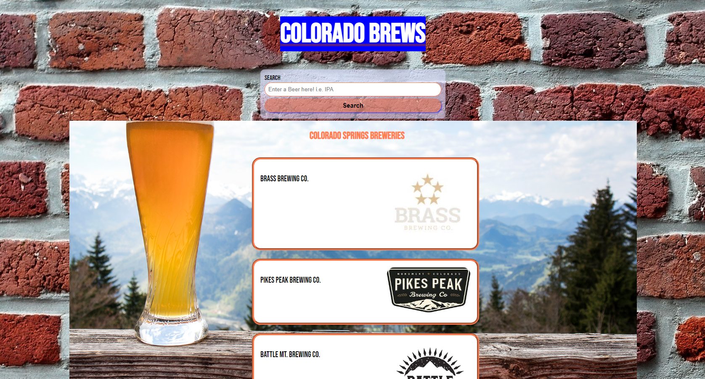
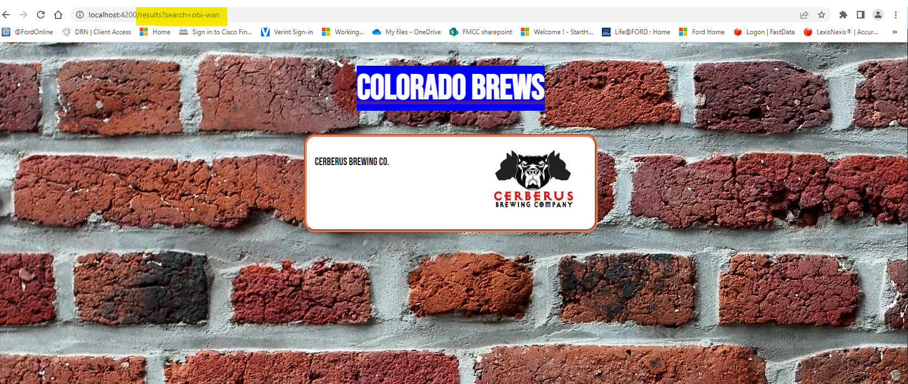
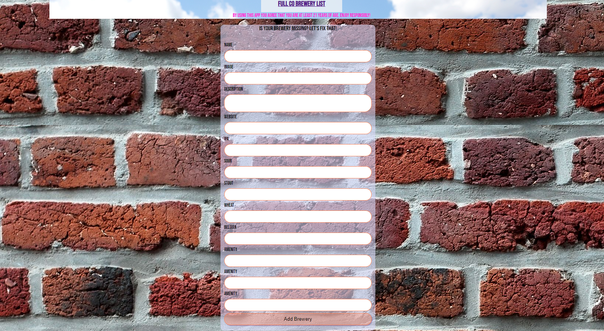

# ColoradoBrews

Welcome to my full stack app!

deployed link: https://scannon-capstone.netlify.app
backend API: https://colorado-brewery-api.herokuapp.com/breweries
TP API, Open brewery DB: https://www.openbrewerydb.org/

This is a CO springs-based brewery finder, the best place to find your perfect pour.

The purpose of this app is to be able to search for a particular beer, type of brew, or amenity that the local breweries might offer. It sets itself apart from many competitors with its specific search feature.

Can't remember where that "obi-wan" themed beer was from? No worries, go ahead and type what it is you are looking for into the search field.

The app will then display those results in a list where they can be perused and clicked to show more information about the brewery you selected.

You are also able to edit, add, and remove breweries as part of its CRUD features.

I have built the back end using information pulled from source websites This is a non-profit app. Neither this app nor its creator is partnered with, or represents, any breweries found within its content.

By using this app you agree that you are at least 21 years of age

This project was generated with [Angular CLI](https://github.com/angular/angular-cli) version 13.3.7.
